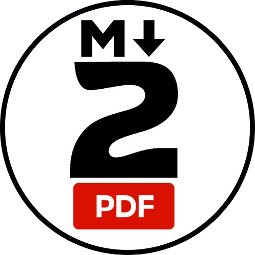

<p align="center">
  
</p>

<h1 align="center">Styled Markdown to PDF</h1>

<p align="right">
  <a href="#english-version">
    
    Switch to English
  </a>
</p>

---

##  Version Française

Convertissez vos fichiers **Markdown** en **PDF élégants** avec page de garde, blocs stylisés, surlignage coloré et options personnalisables.  
Cette extension a été pensée pour **sublimer vos documents**, tout en restant simple et flexible.

### Idéal pour :
- **Prise de notes** rapide et claire.  
- **Comptes rendus** et documents de projet.  
- **Rapports de stage ou de formation.**

---

## Sommaire
- [Fonctionnalités](#fonctionnalités)
- [Commandes Markdown de base](#commandes-markdown-de-base)
  - [Titres](#titres)
  - [Style du texte](#style-du-texte)
  - [Listes](#listes)
  - [Liens et Images](#liens-et-images)
  - [Blocs de code](#blocs-de-code)
  - [Citations](#citations)
  - [Séparateurs](#séparateurs)
  - [Tableaux](#tableaux)
- [Commandes de l’extension](#commandes-de-lextension)
  - [Page de garde](#page-de-garde)
  - [En-tête PDF](#en-tête-pdf)
  - [Saut de page](#saut-de-page)
  - [Notes stylisées](#notes-stylisées)
- [Installation](#installation)
- [Utilisation](#utilisation)
- [Paramètres](#paramètres)
- [Problèmes connus](#problèmes-connus)
- [Notes de version](#notes-de-version)
- [Licence](#licence)
- [Remerciements](#remerciements)

---

## Fonctionnalités

- Conversion **Markdown → PDF** avec page de garde et mise en page stylisée.  
- Support des **titres, listes, tableaux, images et liens**.  
- **Surlignage coloré** et blocs de notes personnalisés.  
- **Liens internes et externes** fonctionnels dans le PDF.  
- **Prévisualisation rapide** avant export.  
- **Mode clair / sombre** pour les blocs de code.  

> Cette version 1.0.0 constitue la base de l’extension — des options avancées arriveront bientôt.

---

## Commandes Markdown de base

### Titres
```md
# Titre niveau 1
## Titre niveau 2
### Titre niveau 3
```

### Style du texte
```md
**gras**
*italique*
~~barré~~

__gras__
_italique_

***grasItalique***
```

### Listes

```md
- Élément à puce
1. Élément numéroté
```

### Liens et images
```md
[Mon site](https://exemple.com)

```

### Blocs de code
```md
`inline code`

```js
console.log("Hello World");
```

### Citations 
```md
> Ceci est une citation
```

### Séparateurs
```md
---
```

### Tableaux
```md
| Colonne 1 | Colonne 2 |
| --------- | --------- |
| Valeur 1  | Valeur 2  |
```

## Commandes de l’extension
### Page de garde
```md
:::cover
title: Mon document
subtitle: Sous-titre
author: Auteur
date: 2025-10-19
textColor: #333
accentColor: #0078D4
backgroundColor: #F8F9FA
align: center
:::
```

### En-tête PDF
```md
:::headerPdf
title: Titre
logo: media/logo.png
date: auto
:::
```

### Saut de page
```md
:::pagebreak:::
```

### Notes stylisées

***Notes Classques :***
```md
:::note[Titre de la note]
Contenu de la note.
:::
```

***Avertissements :***
```md
:::warning[Attention]
Message d’avertissement.
:::
```

***Erreurs :***
```md
:::error[Erreur critique]
Description du problème.
:::
```
## Installation
1. Ouvrez VS Code
2. Recherchez Styled Markdown to PDF
3. Cliquez sur Installer
4. Rechargez VS Code si demandé

## Utilisation
1. Ouvrez un fichier .md
2. Lancez la commande : Styled Markdown to PDF : Export (PDF)
3. Visualisez le rendu et exportez votre document

## Paramètres
- Changer le thème des blocs de code : Palette → Styled Markdown to PDF : Toggle Code Block Theme (Light / Dark)

## Problèmes connus
- Saut de ligne imparfait dans certains blocs de code

## Notes de version
1.0.0 — Première version stable publiée.

## Licence
Distribuée sous licence MIT.<br>
Vous êtes libre d’utiliser, modifier et redistribuer l’extension, tant que la mention de copyright est conservée.<br>
Voir le fichier LICENSE pour plus d’informations.

## Remerciements
Merci aux projets open source suivants :
- [GoogleChrome/puppeteer](https://github.com/GoogleChrome/puppeteer)
- [showdownjs/showdown](https://github.com/showdownjs/showdown)
- [isagalaev/highlight.js](https://github.com/isagalaev/highlight.js)
- [nbesli/pdf-merger-js](https://github.com/nbesli/pdf-merger-js)

---
<p align="right">
  <a href="#version-française">
    
    Switch to French
  </a>
</p>

#  English Version

Transform your Markdown files into elegant, stylish and professional PDFs — complete with cover pages, formatted blocks, color highlights and customizable options.
This extension is designed to beautify your documents while staying simple and flexible.

Perfect for:
- Quick and clean note-taking
- Reports and project documents
- Internship or training summaries

## Table of Contents
- [Features](#features)
- [Basic Markdown Commands](#basic-markdown-commands)
  - [Titles](#titles)
  - [Text Style](#text-style)
  - [Lists](#lists)
  - [Links and Images](#links-and-images)
  - [Code Blocks](#code-blocks)
  - [Quotes](#quotes)
  - [Separators](#separators)
  - [Tables](#tables)
- [Extension Commands](#extension-commands)
  - [Cover Page](#cover-page)
  - [PDF Header](#pdf-header)
  - [Page Break](#page-break)
  - [Styled Notes](#styled-notes)
- [Installation](#installation-1)
- [Usage](#usage)
- [Settings](#settings)
- [Known Issues](#known-issues)
- [Release Notes](#release-notes)
- [License](#license)
- [Credits](#credits)

## Features
- Markdown → PDF conversion with stylish layout and cover page
- Supports titles, lists, tables, images, and links
- Colored highlights and custom note blocks
- Functional internal and external links in PDF
- Quick preview before export
- Light / Dark mode for code blocks

>Version 1.0.0 lays the foundation — more advanced options coming soon.

## Basic Markdown Commands
### Titles
```md
# Level 1 Title
## Level 2 Title
### Level 3 Title
#### Level 4 Title
##### Level 5 Title
###### Level 6 Title
```

### Text Style
```md
**bold**
*italic*
~~strikethrough~~

__bold__
_italic_

***boldItalic***
```
### Lists
```md
- Bullet point
1. Numbered item
```

### Links and Images
```md
[My website](https://example.com)

```

### Code Blocks
```md
`inline code`

```js
console.log("Hello World");
```

### Quotes
```md
> This is a quote
```

### Separators
```md
---
```

### Tables
```md
| Column 1 | Column 2 |
| -------- | -------- |
| Value 1  | Value 2  |
```

## Extension Commands

### Cover Page
```md
:::cover
title: My Document
subtitle: Subtitle
author: Author
date: 2025-10-19
textColor: #333
accentColor: #0078D4
backgroundColor: #F8F9FA
align: center
:::
```

### PDF Header
```md
:::headerPdf
title: Title
logo: media/logo.png
date: auto
:::
```

### Page Break
```md
:::pagebreak:::
```

### Styled Notes

Standard Notes:
```md
:::note[Note Title]
Note content.
:::
```

Warnings:
```md
:::warning[Warning]
Warning message.
:::
```

Errors:
```md
:::error[Critical Error]
Problem description.
:::
```
## Installation
1. Open VS Code
2. Search for Styled Markdown to PDF
3. Click Install
4. Reload VS Code if required

## Usage
1. Open a .md file
2. Run the command: Styled Markdown to PDF : Export (PDF)
3. Preview and export your document

## Settings
- Switch code block theme: Styled Markdown to PDF : Toggle Code Block Theme (Light / Dark)

## Known Issues
- Minor line breaks inside some code blocks

## Release Notes
1.0.0 — First stable release.

## License
Distributed under the MIT License.<br>
You’re free to use, modify, and redistribute the extension, provided that the copyright notice remains.<br>
See the LICENSE file for more details.

## Credits
Thanks to these open-source projects:
- [GoogleChrome/puppeteer](https://github.com/GoogleChrome/puppeteer)
- [showdownjs/showdown](https://github.com/showdownjs/showdown)
- [isagalaev/highlight.js](https://github.com/isagalaev/highlight.js)
- [nbesli/pdf-merger-js](https://github.com/nbesli/pdf-merger-js)
